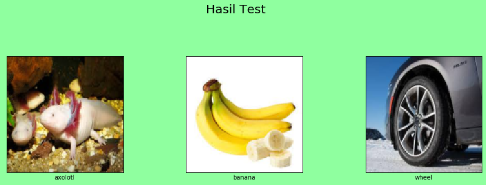

# Tugas GSLC-21 Computer Vision - Pengenalan Citra (Image Recognition)
Matthew Christopher Albert - 2301848981 - LB75

## Metode
Menggunakan CNN dengan input gambar 128x128 (2^x)

## Directory
```bash
|- dataset # sumber train image
|- model
  |- checkpoint # checkpoint training
  |- saved # model yang disimpan 
|- test # image yang diujikan
|- main.ipynb # jupyternotbeook utk train dan testing
```

## Train Data
- 10 gambar axolotl (Binatang)
- 10 gambar pisang (Buah)
- 10 gambar ban mobil (Barang)

## Hasil

